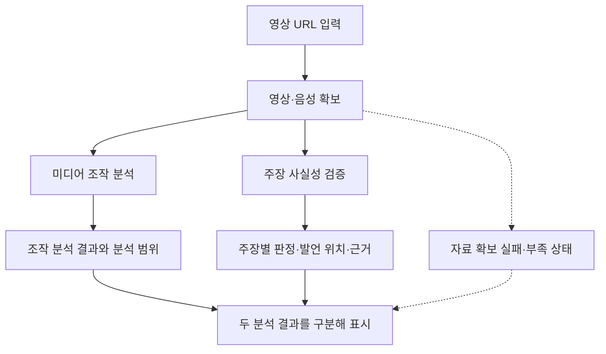
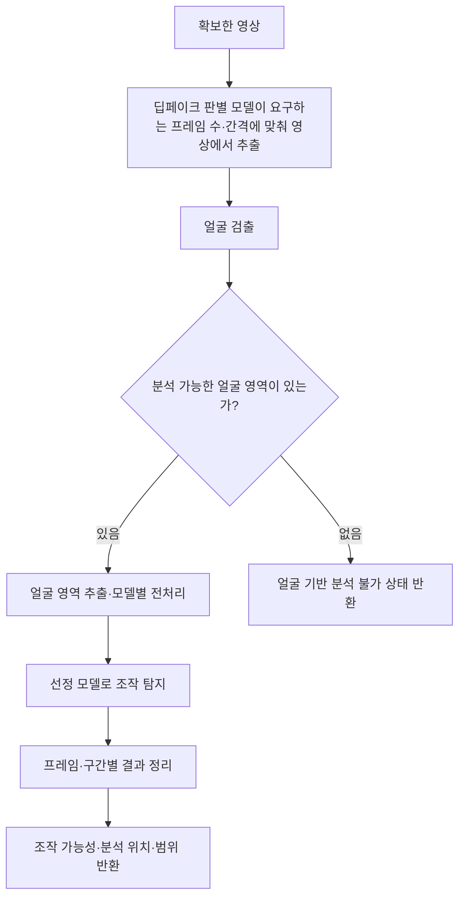
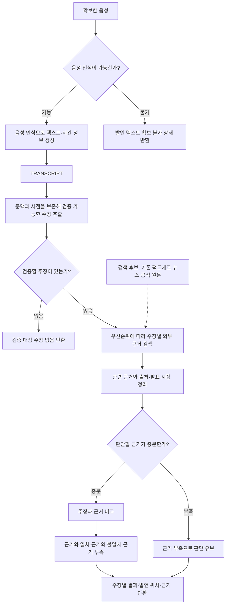

# 참새 AI 파이프라인

- 상태: `Draft`
- 구조·파이프라인 설계 담당: 조정준 팀장
- AI 모델 선정·테스트 담당: 나정균 팀원
- 관련 문서: [제품 요구사항](../project/prd.md), [킥오프 회의록](../meetings/2026-09-03-kickoff.md)

## 문서의 기준

참새 AI의 초기 자료조사 및 기획 시안을 바탕으로 처리 흐름과 기술 후보를 구체화한 설계 초안이다. 제품의 목적과 범위는 제품 요구사항을 참조한다.

아래 흐름은 설계 기준이며 기술 후보 표는 초기 조사 목록이다. 실제 기술 선택은 [기술 선택 반영](#9월-13일-기술-선택-반영)을 따른다. 기술 후보의 링크는 초기 조사 과정에서 수집했으며, 최신 기능·라이선스·성능을 원문과 대조하지 않았다.

초기 구현에서 기존 모델, 오픈소스와 외부 API를 조합한다는 전제는 [프로젝트 가정](../project/assumptions.md#a-04-기존-기술-조합)에 기록한다.

## 처리 흐름 제안

영상 URL에서 분석에 필요한 자료를 확보한 뒤 미디어 조작 분석과 주장 검증을 각각 수행한다. 아래는 검토용 흐름도이며, 특정 모델이나 API의 채택을 뜻하지 않는다. 근거 검색은 병렬 실행을 기본 방향으로 하며 실제 병렬 범위는 비용과 호출 제한을 확인한 뒤 정한다.

### 전체 흐름

두 경로는 서로의 판정을 전제로 하지 않는다. 결과를 한 화면에 모으더라도 하나의 진위 점수로 합치지 않는다. 한쪽만 분석 가능한 경우에도 가능한 분석을 계속하고 완료 결과와 분석하지 못한 범위·이유를 함께 반환한다.

### 미디어 조작 분석

아래는 얼굴 기반 모델을 사용하는 경우의 흐름이다. 모델 선정 결과에 따라 프레임 대신 연속된 영상 구간 등 다른 입력 구성이 필요할 수 있다.

얼굴을 찾지 못하면 정상 영상으로 판정하지 않고 얼굴 기반 분석 불가 상태를 반환한다. 얼굴이 여러 명일 때의 처리, 결과 집계와 표시 기준은 미정이다.

MVP는 얼굴 합성·변형만 탐지 범위에 포함하며 영상 전체 AI 생성과 음성 합성은 제외한다. 영상 전체 AI 생성은 탐지 대신 제목·설명의 업로더 표기를 읽어 전달한다. 도입할 때 필요한 입력 데이터, 탐지 기술 후보와 기존 파이프라인 연결 방식은 그 시점에 설계한다.

### 주장 사실성 검증

MVP의 발언 텍스트는 음성 인식으로 생성하며 자막은 분석에 사용하지 않는다. 다만 추후 자막 경로를 추가할 수 있도록 백엔드 API에는 자막 활용 여부를 선택하는 선택적 요청 항목을 둘 수 있게 설계한다. MVP 프런트엔드는 이 항목을 요청하지 않으며 기본값은 자막 미사용이다. 구체적인 항목명과 자막 데이터의 확보·검증 방식은 백엔드 API를 설계할 때 정한다. 음성 인식 실패 처리는 추가로 정한다. 근거 선택, 충분성 판정과 출처 충돌 처리는 [주장 근거 선택과 판정 정책](evidence-policy.md)을 따른다.

#### 주장 선정과 처리 순서

지원 주제는 제한하지 않는다. 영상에서 외부 근거와 사실 여부를 비교할 수 있는 주장을 모두 추출한다. 의견, 감상, 질문처럼 사실 판정이 불가능한 문장은 제외한다. 같은 의미를 다른 표현으로 반복한 주장은 하나로 합치고, 발언 위치 목록과 반복 횟수를 보관한다.

처리 우선순위는 다음 기준을 순서대로 적용한다.

1. 영상 제목과 전체 내용에서 핵심 주제로 판단되는지 확인한다.
2. 같은 주장이 영상에서 반복해서 언급되었는지 확인한다.
3. 인물, 기관, 날짜, 수치와 사건처럼 외부 근거와 대조할 구체적인 정보가 포함되었는지 확인한다.
4. 앞의 조건이 같으면 영상에서 먼저 등장한 주장을 우선한다.

우선순위는 처리 순서만 결정한다. 낮은 순위의 주장도 모두 검증하며, 검색 결과가 없거나 근거가 부족하면 해당 주장을 누락하지 않고 `근거 부족` 상태로 반환한다.

#### 진행 상태와 결과 전달

MVP는 Firestore 실시간 구독, WebSocket과 SSE를 사용하지 않고 `jobId` 기반 폴링으로 진행 상태와 결과를 전달한다. 분석 요청을 받으면 서버는 `jobId`를 반환하고, 클라이언트는 직전 요청이 끝난 뒤 2 ~ 3초를 두고 다음 상태를 조회한다. 정확한 간격과 재시도 조건은 백엔드 API 계약을 따른다. 서버는 주장별로 대기·처리 중·완료·실패 상태와 완료된 결과를 누적해 반환한다. 클라이언트는 새로 완료된 주장 결과를 화면에 추가한다.

서버는 우선순위가 높은 주장부터 검증을 시작한다. 기존 팩트체크 자료와 뉴스·공식 자료 검색은 병렬 실행을 기본 방향으로 삼는다. 나정균 팀원이 검색 수단별 호출 비용, 호출 제한과 응답 시간을 확인한 뒤 실제 병렬 범위와 동시 요청 수를 정한다. 모든 주장의 상태와 우선순위를 유지하며, 먼저 완료된 결과를 폴링 응답에 포함한다. 폴링 간격 조정, 작업 만료, 재시도와 중단 조건은 구현 단계에서 정한다.

주장 추출 이후 모든 주장 카드를 만들고 폴링 결과에 따라 갱신하는 화면 흐름과 최종 요약 시점은 [분석 진행과 결과 UI](result-ui.md)에서 정의한다.

점선은 보조 정보 또는 예외 경로를 나타낸다. 도식은 주요 분기를 설명하며 재시도·시간 초과·모델 실행 오류 등 모든 예외를 정의한 구현 명세는 아니다.

## 단계별 설계 초안

| 단계 | 입력 → 출력 구상 | 확인할 사항 |
| --- | --- | --- |
| 데이터 확보 | URL → 영상·음성 | 지원 URL, 실제 수집 가능 여부, 이용 조건, 실패 처리. 자막 수집은 MVP 이후 선택적 API 경로로 검토 |
| 발언 텍스트 생성 | 음성 → 텍스트·시간 정보 | 한국어 인식 품질과 음성 인식 실패 처리. 자막은 MVP 분석에서 제외하며 API 확장을 위한 선택적 요청 항목만 고려 |
| 영상 전처리 | 영상 → 샘플 프레임·얼굴 영역 | 샘플링 간격, 모델별 전처리 조건, 얼굴이 없거나 여러 명인 경우 |
| 딥페이크 조작 탐지 | 전처리한 얼굴 이미지 또는 연속된 영상 프레임을 딥페이크 판별 AI 모델에 전달 → 이미지·영상 구간별 조작 가능성 분석 결과 | 판별 모델 선정, 필요한 이미지 크기·프레임 수 등 입력 형식, 탐지 범위, 개별 결과를 영상 단위로 정리하는 방식과 판정 기준 |
| 주장 추출 | 텍스트·시간 정보 → 중복을 합친 검증 대상 주장·발언 위치·반복 횟수·우선순위 | 사용할 모델과 구조화된 출력 형식, 문맥·시점 보존 방식 |
| 근거 검색 | 주장 → 관련 근거 문서 | 한국어 검색 수단, 원문 확보, 검색 범위와 날짜 조건 |
| 근거 비교 | 주장·근거 → 근거와 일치·근거와 불일치·근거 부족 결과 | [주장 근거 선택과 판정 정책](evidence-policy.md)에 따른 관련성·시점·출처·충돌과 인용 확인 |
| 결과 전달 | `jobId`와 주장별 상태·완료 결과 → 폴링 응답 | 폴링 간격 조정, 작업 만료, 재시도·중단 조건, 부분 성공·실패 표시 문구와 결과 데이터 형식 |

분석 작업 대기열, Worker, 상태 모델, 동시 처리와 결과 캐시는 [분석 실행 구조와 확장 기준](analysis-runtime.md)에서 정의한다.

여기서 딥페이크 판별 AI 모델은 이미지나 영상의 시각적 특징을 분석해 조작 가능성을 판단하는 모델을 뜻한다. 구체적인 모델은 나정균 팀원이 선정·테스트 중이다. 모델에 따라 얼굴 이미지 한 장을 분석하거나 연속된 여러 프레임을 함께 분석할 수 있으므로, 전달할 데이터의 형식과 전처리 방법은 선정 결과에 맞춰 정한다.

영상에서 프레임을 추출하는 간격과 개수는 딥페이크 판별 모델의 입력 조건과 테스트 결과에 따라 정한다.

## 기술 후보

모든 후보의 라이선스와 사용 조건은 미확인이다. 코드뿐 아니라 사용하려는 모델 가중치와 데이터의 조건도 별도로 확인해야 한다. 외부 API와 서비스는 오픈소스와 구분해 검토한다.

| 영역 | 기술 후보 | 출처 | 선정 전 확인할 내용 |
| --- | --- | --- | --- |
| 영상 확보 | yt-dlp | [GitHub](https://github.com/yt-dlp/yt-dlp) | 실제 입력에서 영상·음성 수집 가능 여부와 서비스 이용 조건. 자막 확보는 MVP 이후 선택적 경로에서 검토 |
| 영상·이미지 처리 | FFmpeg, OpenCV | 확인 필요 | 공식 출처·라이선스와 필요한 처리 범위 확인 |
| 얼굴 검출 | MediaPipe | [GitHub](https://github.com/google-ai-edge/mediapipe) | 선정 모델에 필요한 얼굴 검출·전처리와 호환되는지 확인 |
| 음성 인식 | Whisper, faster-whisper | [Whisper](https://github.com/openai/whisper), [faster-whisper](https://github.com/SYSTRAN/faster-whisper) | 한국어 입력 품질, 실행 환경, 처리 시간·메모리 비교 |
| 시간 정보 정렬 | WhisperX | [GitHub](https://github.com/m-bain/whisperX) | 기본 시간 정보로 충분한지, 추가 정렬의 필요성과 비용 확인 |
| 조작 탐지 모델 비교 | DeepfakeBench | [GitHub](https://github.com/SCLBD/DeepfakeBench) | 실제 사용할 개별 모델, 가중치, 탐지 범위와 실행 조건 확인 |
| 주장 추출 | 일반 LLM과 구조화된 출력 | 미정 | 구체적인 모델·제공 방식·비용은 미정 |
| 기존 팩트체크 검색 | Google Fact Check Tools API | [공식 문서](https://developers.google.com/fact-check/tools/api) | 한국어 주장 검색 결과, 접근 조건과 제한 확인 |
| 뉴스 검색 | GDELT | [공식 사이트](https://www.gdeltproject.org/) | 한국어 검색 품질, API 사용 조건과 원문 확보 방식 확인 |
| 국내 근거 검색 | 네이버 뉴스, Google News, 국내 언론사·정부·공공기관 자료 | 미정 | 검색·접근 수단과 공식 출처·사용 조건은 미정 |
| 주장과 근거 비교 | LLM, NLI 또는 조합 | 미정 | 구체적인 모델과 한국어 판정 품질은 미정 |

초기 조사에서 수집한 조작 탐지 후보는 Xception, MesoNet, EfficientNet, Face X-Ray, F3Net, SBI, LSDA, Effort, TALL, I3D, STIL, FTCN, X-CLIP, TimeTransformer, VideoMAE다. 각 후보의 지원 여부와 적합성은 확인 전이며, 이 목록을 테스트 대상이나 우선순위로 확정하지 않는다.

faster-whisper의 우선 도입 여부는 비교 결과를 확인한 뒤 결정한다. WhisperX의 추가 도입, DeepfakeBench 활용과 검색 서비스 선택도 모델 테스트 및 설계 검토 후 결정한다.

## 주장 검색과 근거 비교의 쟁점

언론사·팩트체크 기관이 이미 공개한 주장 검증 결과와 관련 뉴스·공식 자료를 병렬로 검색하고, 확보한 근거를 영상 속 주장과 비교한다. 실제 병렬 범위와 동시 요청 수는 검색 수단별 호출 비용·제한과 응답 시간을 확인한 뒤 정한다.

근거의 관련성·시점·출처 확인, 출처 충돌과 `근거 부족` 처리는 [주장 근거 선택과 판정 정책](evidence-policy.md)을 따른다. 관련 자료를 찾지 못한 사실만으로 주장을 `근거와 불일치`로 판정하지 않는다.

NLI, Cross Encoder, Reranker는 추가 조사 후보로 남긴다. 검색 결과 순위 조정과 최종 주장 판정 중 어느 단계에 필요한지는 아직 결정하지 않았다.

## 모델 테스트와 평가 결과 연계

나정균 팀원이 비공개 Playground 저장소에서 모델 테스트를 진행 중이며, 결과는 별도로 남겨 전달하기로 했다. 킥오프에서 정한 9월 5일 준비 항목은 딥페이크 판별 모델의 성능·신뢰도 비교다. 이 문서에는 전달받지 않은 실험 결과를 작성하지 않는다.

실험 코드·샘플·실행 스크립트는 Playground에서 관리한다. 결과를 받으면 저장소 기준에 따라 `evaluations/` 기록과 연결하고, 이 문서에는 채택한 모델과 설계에 미친 영향만 반영한다. 평가 기록의 실제 위치와 링크는 결과 공유 시 확인한다.

모델 비교 시 검토할 항목은 탐지 방식, 데이터셋 간 성능, 대상 조작 유형, 사전 학습 가중치, GPU·메모리 요구량, 처리 시간, 모델 크기, 라이선스와 유지보수 상태다. 이는 나정균 팀원이 실제 수행한 테스트 항목을 뜻하지 않는다. FaceForensics++, Celeb-DF, DFDC 역시 초기 조사에서 수집한 데이터셋 예시이며 사용 여부는 확인되지 않았다.

## 성능 측정

단계별 처리 시간과 자원 사용량, 복수 요청과 폴링 부하의 측정 항목은 [분석 실행 구조와 확장 기준](analysis-runtime.md#성능-측정)에서 관리한다. 이 문서에서는 선정 모델의 입력 조건과 단계별 분석 방법에 영향을 주는 평가 결과만 반영한다.

## 남은 기술 확인

1. 제품에서 정한 조작 탐지 범위와 테스트 중인 모델의 실제 탐지 범위가 일치하는지 확인한다.
2. 지원할 영상 조건과 실행 환경에서 수집부터 결과까지 연결 가능한지 확인한다.
3. 한국어 주장에 사용할 검색 수단과 접근 조건을 확인한다.
4. 단계별 입출력 형식, 요청당 비용과 재시도 방식을 정한다.
5. 모델 평가 결과를 바탕으로 기술 후보를 줄이고 [프로젝트 가정](../project/assumptions.md)을 갱신할 필요가 있는지 확인한다.

## 9월 13일 기술 선택 반영

[PR #5의 후속 답변](https://github.com/chamsae-ai/docs/pull/5#discussion_r3976434618)과 [PR #7의 LLM 선택 답변](https://github.com/chamsae-ai/docs/pull/7#discussion_r3999130461)을 반영한다. 기존 기술 후보 표는 초기 조사 목록이며 아래 채택 사실과 구분한다.

- 영상·음성 확보는 yt-dlp, 음성 인식은 faster-whisper, 프레임 추출은 PyAV, 얼굴 검출은 MediaPipe, 얼굴 분류는 `dima806/deepfake_vs_real_image_detection`을 사용한다. 영상 전체 AI 생성 모델 선정 완료를 뜻하지 않는다.
- LLM은 주장 추출과 근거 관계 판정에 사용한다. DeepSeek 연결은 구현됐으며 실제 사용 제공자는 배포 설정과 실행 기록으로 확인한다. NLI는 추가 후보다.
- 국내 검색은 네이버 뉴스·백과사전 경로를 추가했다. 위키백과 및 설정에 따른 Google Fact Check 경로와 구분한다. BigKinds·KOSIS는 후보 조사만 했고 연결하지 않았다. 성능 시험 실패가 아니라 미연동 상태다.
- 같은 날 회의에서 위키백과를 근거 검색에서 빼기로 했고 2026-09-17에 반영을 마쳤다. 위키백과가 붙은 주장에 관련 없는 문서가 자주 섞여 근거 부족으로 처리됐기 때문이다. 위 목록은 회의 이전의 연결 상태이며 현재 기본 검색 수단은 팩트체크와 네이버 뉴스·백과사전이다. 근거는 [9월 13일 회의록](../meetings/2026-09-13-integration.md#결정-사항)이다.
- 자막은 T-02에 따라 기본 미사용이며 선택적 API 경로만 남긴다. 현재 코드 기본값은 off다. 프레임 집계 기본값 trimmed_mean은 [두 영상 비교](../evaluations/frame-aggregation-comparison.md)를 거쳐 적용했으며 일반적인 정확도 개선은 검증하지 않았다.
- 주장별 검색·판정은 기본 3건 병렬이며 한 주장 안의 제공자 검색은 순차다. 제공자 병렬 확대는 비용·제한·시간을 확인한 뒤 정한다.

구현과 배포의 대조는 [최신 점검](../evaluations/mvp-implementation-audit.md#2026-09-13-재점검)을 따른다. 모델 사용 조건과 품질이 모두 검증됐다는 의미로 채택 사실을 해석하지 않는다. 미결 항목은 [프로젝트 계획](../project/project-plan.md#미결-사항과-일정-확인)에서 관리한다.
